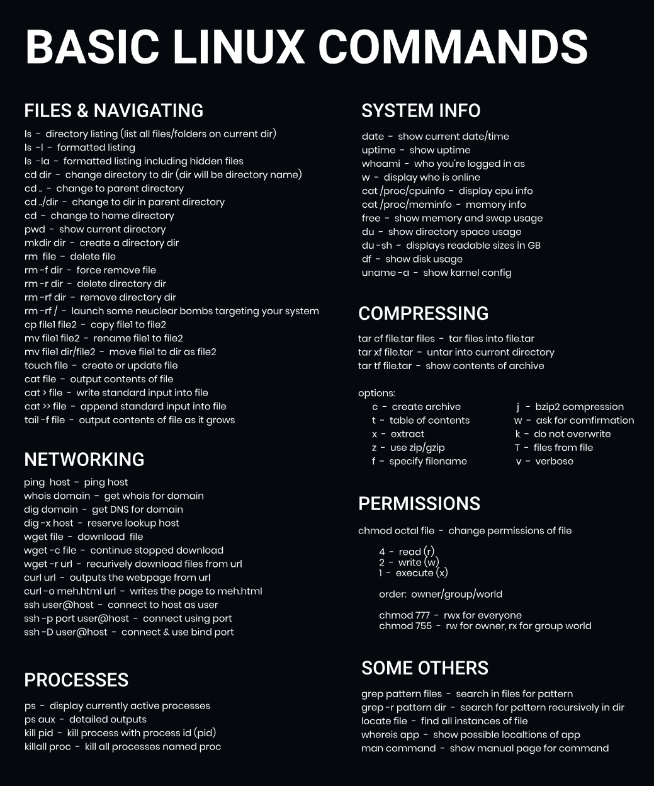

# Linux Crashcourse Part 2!!
## Operating System Setup

| USB-Method | Virtual Machine |
|------------|-----------------|
| [USB-Instuctions](./READMEs/USB_README.md) | [VM-Instructions](./READMEs/VM_README.md) |

## Tools for this Course

| Fastfetch | Starship | Waybar |
|-----------|----------|--------|
| [Fastfetch Instructions](./READMEs/FASTFETCH_README.md) | [Starship Instructions](./READMEs/STARSHIP_README.md) |
## Bash Command Cheat Sheet:

